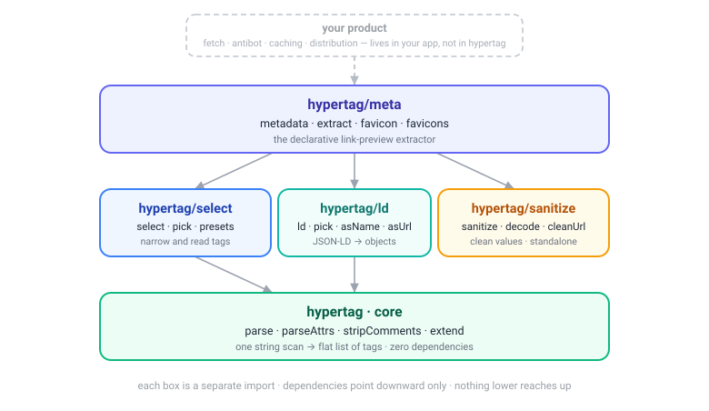

# hypertag – context

Tiny zero-dependency HTML tag and attribute parser. This document is the standing
description of the project's shape and vocabulary. It is a living doc: update the layer
table below as layers are actually added. Decisions and their rationale live in
`docs/adr/`; this file records what *is*, not why it was chosen.

## Architecture

hypertag is a **stacked set of optional utility layers** over a small, fast core. Three
rules govern how it grows (see ADR-0001 for the reasoning and the alternatives rejected):

1. **Keep each layer clean and honest** – a layer's API promises exactly what it does and
   hides no domain assumption.
2. **Keep the core simple and fast** – layer 0 knows only tags and attributes, stays
   zero-dependency and edge-sized.
3. **Gradually stack optional layers** – each capability goes in the lowest layer that can
   host it honestly, is opted into by importing, and depends only on the layers beneath.

Dependencies point **down only**: nothing lower ever imports something higher.

Every layer up to and including `meta` is **HTML-in, string-only** – it takes markup you already
have and never reaches outside the process. `fetch` (layer 4) is the single, deliberate exception:
an opt-in convenience that touches the network. It is bounded by the same principle that kept the
network out to begin with – **the library never owns the network's hard parts**. It does the happy
path (native `fetch` → `metadata()`) and delegates encoding, SSRF, caching, antibot and
rate-limiting back to the caller via a pluggable `fetch`. See ADR-0001's amendment.

| layer | package | knows about | responsibility | status |
| --- | --- | --- | --- | --- |
| 0 · core | `hypertag` | tags + attributes | scan HTML → flat `Tag[]`. Zero-dep, edge-sized. | shipped |
| 1 · select | `hypertag/select` | tags + selectors | narrow and read tags (selectors, presets, `pick`). | shipped |
| 1 · sanitize | `hypertag/sanitize` | values | decode / clean / resolve values. | shipped |
| 2 · ld | `hypertag/ld` | JSON | unwrap JSON-LD shapes. First non-HTML code. | shipped |
| 3 · meta | `hypertag/meta` | metadata conventions + a default opinion | declarative extractor: engine + source helpers + default rules (overridable). | shipped |
| 4 · fetch | `hypertag/fetch` | the network, thinly | opt-in convenience: fetch a URL with native `fetch` → `metadata()`. Happy path only. | shipped |
| product | separate, metalink-shaped | the hard parts of the network | antibot, caching, distribution, and the hard parts of fetching (non-UTF-8 decoding, SSRF, rate-limiting) – pluggable into the fetch layer, never baked in. | out of library scope |

**Where new code goes.** A general mechanism over tags/selectors → `select`. A value-to-
cleaner-value transform, field-agnostic → `sanitize`. Anything operating on parsed JSON
rather than HTML → `ld` (never core). Anything encoding which source means which field, or a
preference between sources → the `meta` layer's rules (never lower). The *happy path* of fetching
(native `fetch` → `metadata()`) → the `fetch` layer, kept thin. The *hard parts* of the network –
non-UTF-8 decoding, SSRF policy, caching, antibot, rate-limiting → stay pluggable and the caller's
(pass your own `fetch`), never baked into the library.

## Glossary

Use these terms – in issues, ADRs, refactor proposals, test names – rather than synonyms.

- **Core** – the layer 0 package (`hypertag`): `parse`, `parseAttrs`, `stripComments`,
  `extend`. Returns a flat `Tag[]`. No cooked values, no domain knowledge.
- **Tag** – one matched opening tag as a plain object: its attributes, plus the tag name
  under `$tag`, plus (with the `content` option) element content under `$content`.
- **Layer** – an opt-in package that adds capability over the layers beneath it, imported
  separately so its cost is only paid when used.
- **Honest layer** – one whose API promises exactly what it does and leaks no assumption
  from a higher layer downward (e.g. `select` never bakes in metadata priorities).
- **Mechanism vs. rules** – a *mechanism* is domain-agnostic (`pick` does preference-
  ordered first-match; the caller supplies the order). A *rule* encodes domain knowledge
  (og beats twitter; this selector means "title"). Mechanisms live low; rules live high.
- **`pick`** – layer 1 mechanism: first usable value across an ordered list of
  `[selector, attr]` sources, in the caller's preference order. No metadata knowledge.
- **Source helper** – a `meta`/`link`/`content`/`ld` marker the `meta` rules list; it encodes
  an HTML-metadata *convention* (property≈name, `rel` word-match, element text, JSON-LD shape),
  not a domain opinion.
- **Parse cache** – an optional caller-owned `Map` passed to `parse` (4th arg) that memoizes
  identical parses of the same source. It is local, not shared: create one per operation and
  thread it down, so concurrent async operations never mix caches. The `meta` layer makes one
  per page so the per-field re-parses of `<meta>`/`<link>` collapse to one each.
- **Cooked value** – a normalized, domain-resolved output (a page's "title"). Producing
  cooked values is the job of the `meta` layer, not the core.
- **Fetch layer** – the layer 4 package (`hypertag/fetch`): `fromUrl(url, options?)`, a thin
  opt-in wrapper that fetches with the native `fetch` and runs `metadata()` on the body. The one
  layer that touches the network, and the only non-HTML-in entry point. It owns the happy path
  only; the network's hard parts (encoding, SSRF, caching, antibot) are pluggable and the
  caller's, never the library's.
